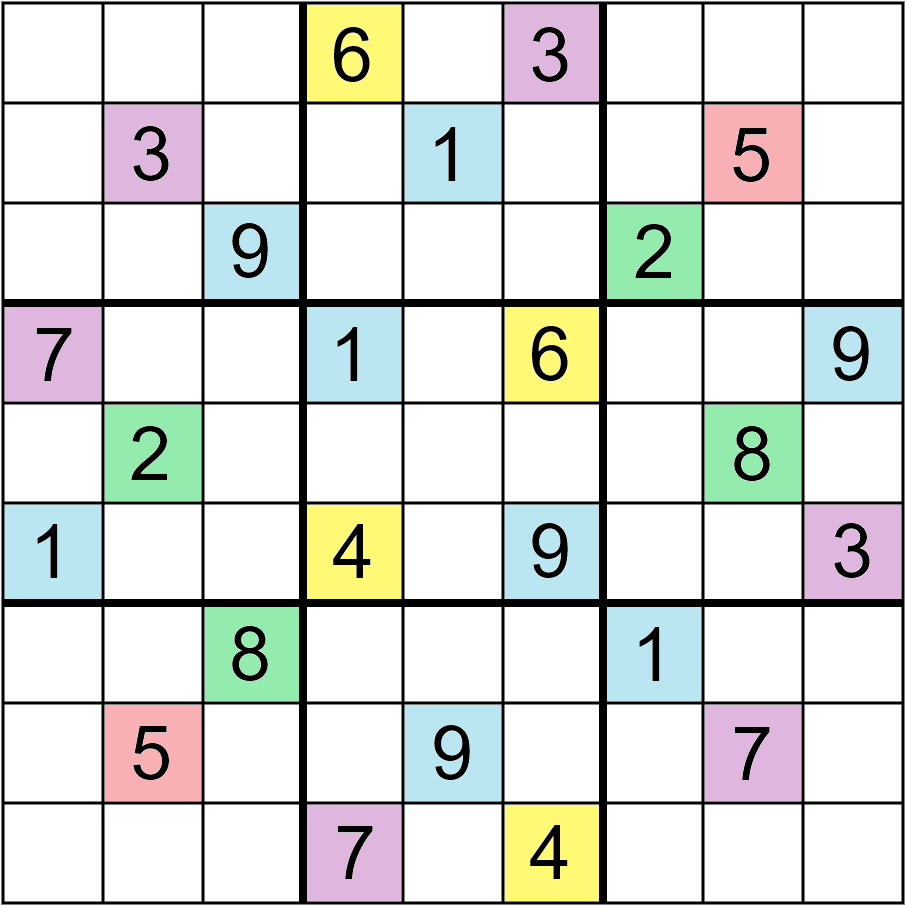

In this talk we will explore the nature of proofs in mathematics through the familiar setting of Sudokus. Mathematical logic offers a rigorous and elegant way to analyze Sudokus. By applying logical principles and deduction, one can prove properties of Sudoku grids which can give rise to more interesting puzzles. On the other hand, one may also apply brute force computations to analyze Sudokus. By systematically trying all possible combinations of numbers, computers can answer questions about the uniqueness of solutions or the minimum number of givens required for a valid puzzle.

These different approaches raise intriguing questions about the nature of proof and the role of computation in mathematics. Is there an inherent beauty in the logical elegance of mathematical proofs? Can brute force computations be considered valid proofs, or do they merely provide evidence without the same level of certainty? And is there more to a proof than simply knowing with certainty the answer to a question?

---

[Laertis Vaso](https://www.laertisvaso.com/) is a post doc. in mathematics at NTNU. Research info.

